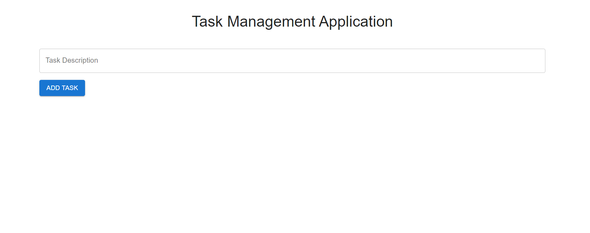

# Task Manager Application

This project has two parts - Front End and Back End and this is Frontend part.
To run the Task Manager Application you need to run the backend application first.

## Available Scripts

In the project directory, you can run:

### `npm start`

Runs the app in the development mode.\
Open [http://localhost:3000](http://localhost:3000) to view it in the browser.

